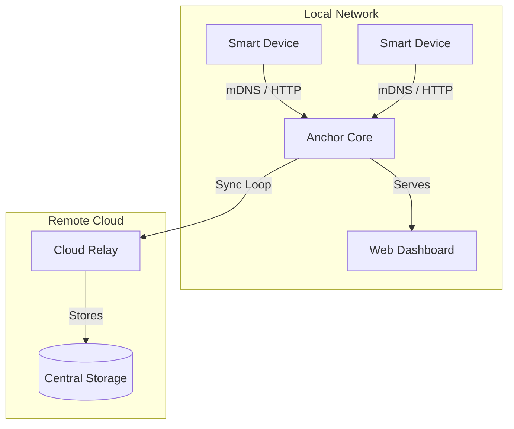

# Anchor ⚓

Anchor is a **local-first** device management system designed for resilience and low-latency control. It allows local devices to discover a central hub, buffer data during network outages, and sync telemetry to a cloud relay when connectivity is available.

## Core Philosophy
- **Local Sovereignty**: Devices communicate directly with a local hub (Anchor Core).
- **Resilience**: mDNS discovery ensures connectivity even without static IPs.
- **Data Continuity**: Offline buffering prevents data loss during infrastructure failures.
- **Hybrid Sync**: Automatic background synchronization to the cloud.

---

## 🏗 Architecture



---

## 🚀 Getting Started

### Prerequisites
- Node.js (v18+)
- npm

### Installation
```bash
git clone <repository-url>
cd anchor
npm install
```

### Running the System

You can run the different components using the following npm scripts:

| Component | Command | Description |
| :--- | :--- | :--- |
| **Anchor Core** | `npm run dev` | Starts the local management hub on port `3333`. |
| **Simulator** | `npm run simulate` | Starts a virtual device that discovers Core and sends data. |
| **Cloud Relay** | `node server/cloud_mock.js` | Starts the mock cloud ingestion server on port `4000`. |

---

## 📂 Project Structure

- `server/server.js`: The central Anchor Core hub.
- `server/cloud_mock.js`: A mock implementation of the cloud ingestion API.
- `scripts/simulate_device.js`: A standalone script to simulate device behavior.
- `agent/Agent.js`: A reusable class for building Anchor-compatible device agents.
- `public/`: The web dashboard assets (HTML/CSS).

---

## 📡 API Reference

### Anchor Core (Local - Port 3333)

- **GET `/api/devices`**: Returns a list of all known devices and their current state.
- **GET `/api/system/logs`**: Returns recent system events.
- **POST `/api/devices/heartbeat`**: Endpoint for single device status updates.
- **POST `/api/devices/sync`**: Bulk ingestion endpoint for uploading buffered offline data.

### Cloud Relay (Mock - Port 4000)

- **POST `/api/cloud/ingest`**: Ingests batches of telemetry from Anchor Core.
- **GET `/api/cloud/data`**: View all raw data stored in the cloud.

---

## 🔧 Resilience Features

### mDNS Discovery
Devices do not need to know the IP address of the Anchor Core. They scan for the `_anchor._tcp.local` service. Anchor Core announces itself periodically and responds to queries, allowing for zero-configuration networking.

### Offline Buffering
If a device loses connection to the local hub, it switches to `OFFLINE_BUFFERING` mode. It stores heartbeats in a local memory buffer and periodically probes for the hub. Once reconnected, it uses the `/api/devices/sync` endpoint to upload the backlog.

---

## 🛠 Development
For more detailed technical info, see [architecture.md](./architecture.md).
