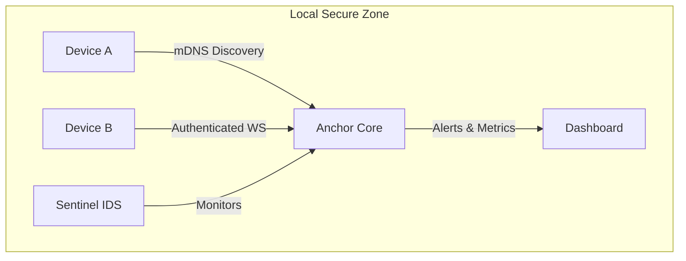

# Anchor™ ⚓


> **A Secure, Local-First IoT Orchestration Platform.**  
> *Developed by [jABurat23](https://github.com/jABurat23)*


Anchor is a resilient device management system designed for **edge environments** where cloud connectivity is intermittent or untrusted. It enables devices to discover a local hub, buffer telemetry during outages, and stream real-time data with robust fallback mechanisms.

---

## 🚀 Key Features

### 🛡️ Secure by Design
- **Authenticated Handshakes**: Strict API Key validation for all HTTP and WebSocket connections.
- **Sentinel IDS**: Built-in Intrusion Detection System that flags brute-force attacks and anomalous behavior.
- **Identity Issuance**: Server-side device Registration prevents identity spoofing.

### 📡 Resilient Connectivity
- **Zero-Config Discovery**: Devices find the hub automatically using **mDNS** (`anchor-core.local`).
- **Offline-First**: Devices buffer data when the network is down and automatically sync (batch upload) upon reconnection.
- **Smart Fallback**: Live video streams automatically downgrade to high-frequency snapshots on non-SSL networks.

### ⚡ Real-Time Dashboard
- **Live Telemetry**: Monitor device health, uptime, and performance metrics.
- **Interactive Control**: Ping devices, push files, and trigger remote actions.
- **Security Alerts**: Real-time "Defcon-style" warnings when threats are detected.

---

## 🏗 Architecture



For a deep dive into the system internals, read [ADDRESSING_ARCHITECTURE.md](./architecture.md).

---

## 🛠️ Getting Started

### Prerequisites
- Node.js v18+
- npm

### Installation

```bash
git clone https://github.com/jABurat23/anchor.git
cd anchor
npm install
```

### Running the Core

```bash
npm run dev
```

The system will start on **port 3333** and announce itself via mDNS.
Access the dashboard at: `http://localhost:3333`

### Simulating a Device

To verify the system, you can run the verification script which acts as a secure client:

```bash
node scripts/verify_backend_ws.js
```

---

## 🤝 Contributing

We welcome contributions! However, Anchor is designed with a specific philosophy of **security** and **simplicity**.

### Rules for Pull Requests
1.  **Security First**: Any new endpoint MUST be authenticated. Unsecured routes will be rejected.
    *   *Bad*: `app.get('/api/data', ...)`
    *   *Good*: `app.get('/api/data', checkAuth, ...)`
2.  **Offline Compatibility**: Features must handle network failure gracefully.
3.  **No Bloat**: Keep dependencies minimal. We prefer native solutions over heavy frameworks.

### Roadmap
Check [ROADMAP.md](./ROADMAP.md) to see what we are currently working on.

---

## 📄 License

This project is licensed under the MIT License - see the [LICENSE](LICENSE) file for details.

---

*“Build locally, scale globally.”* — **jaDev**
